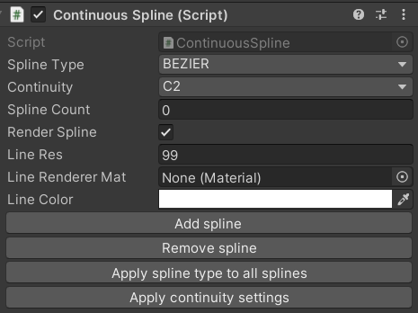
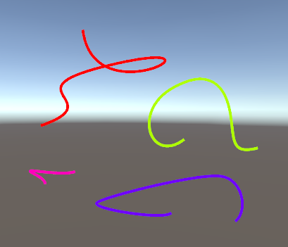
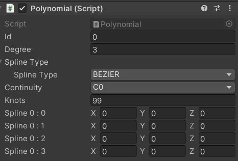

# **Spline Editor**

This project is a spline editor, allowing user to create Hermite, Bezier, B and Catmull-Rom splines.

## Summary
- [Getting started](#getting-started)
    - [Editor](#editor)
- [Features](#features)
- [Problems and bugs](#problems-and-bugs)
- [Updates](#updates)

# Getting started

## Editor
Create an empty object and add the ContinuousSpline script to it.

The editor gives the user several options, the spline editing can be entirely done with the 4 buttons :
- Add spline
    - add a new spline fraction to the full continuous spline
- Remove spline
    - remove the latest spline fraction
- Apply spline type to all splines
    - change all spline fraction to the specified spline type (specified in the combo box "Spline Type")
- Apply continuity settings
    - change all spline fraction continuity between C0 and C2, C1 is not implemented

- Red : Hermite
- Green : Bezier
- Pink : B-Spline
- Purple : Catmull-Rom

User can use single 4 control points spline with the Polynomial script.

Knots parameter is the amount of step of the gizmo line rendering.

# Features
- Splines
    - Hermite
    - Bezier
    - B-Spline
    - Catmull-Rom
    - Calculation
        - calculations are made with matrices
        - the class SplineType contains each spline matrices
- Continuity
    - C0
    - C2
- Line Rendering

# Problems and bugs
- Hermite spline is not well serialized
    - the control points sometimes resets to the default position
- All spline type are not updated in real time, user should select the spline gameobject to update its control points' positions.

# Updates
Next features :
- Continuity
    - C1
- Better serialization
- Object that follows the path of the spline (should be done using the function ContinuousSpline.S(t) in ContinuousSpline.cs)
- create a path with the spline (display a texture with a certain step amount)